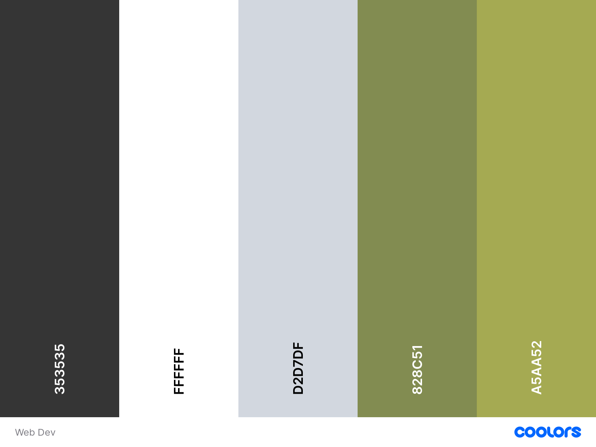
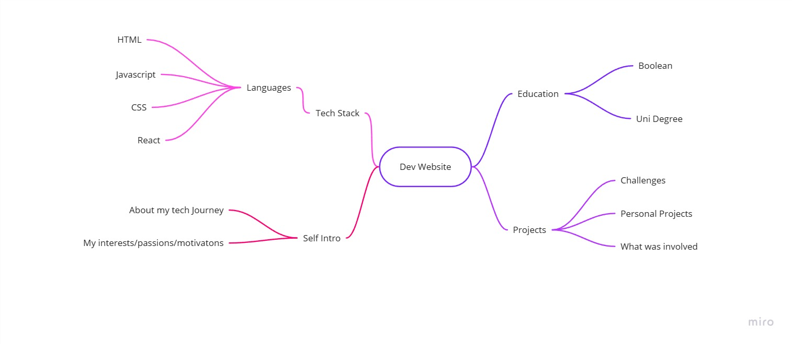
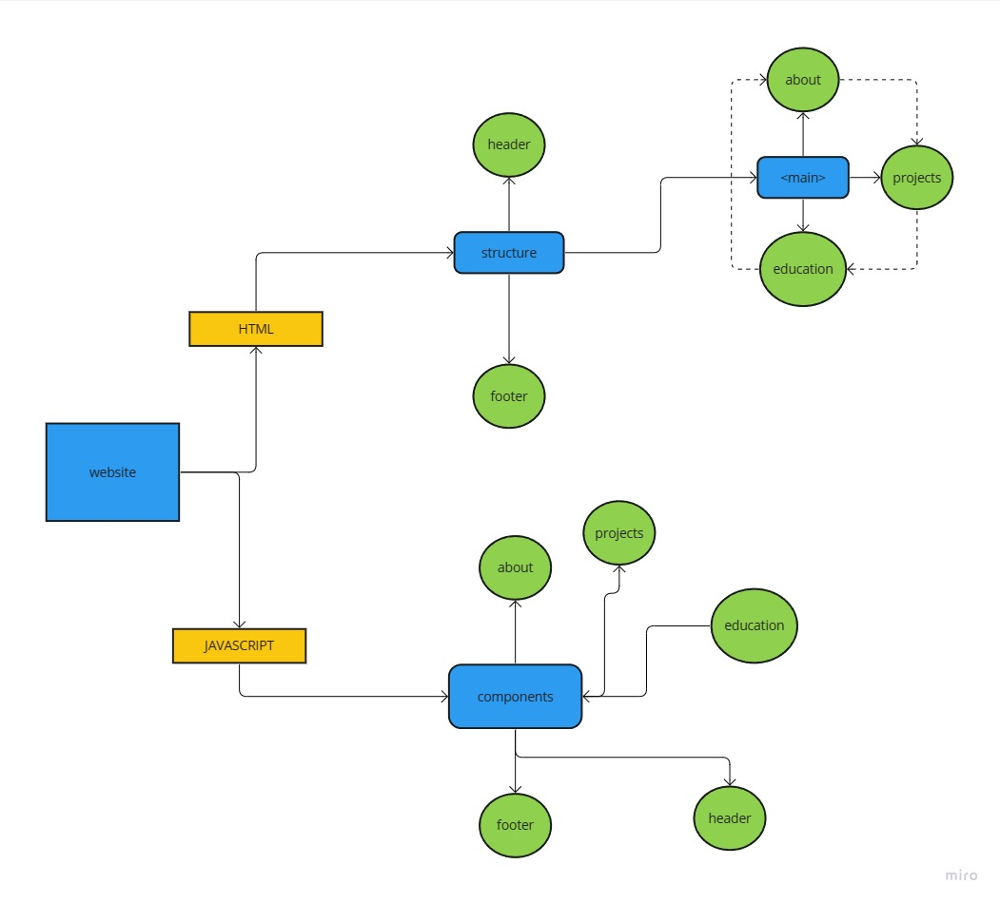

# READ ME

About My Portfolio Project

Tech Stack (i.e. what technology / frameworks / libraries you used)
Why This Stack

Links
Online Hosted Portfolio
Portfolio GitHub Repo

## PLAN

- [] Biography/Self-Intro - a paragraph or two about you.

- [] Tech Stack - the languages/technologies that you have experience with.

- [] Education / Experience - only those that are relevant to coding / the line of work you want to go into.

- [] Projects - sites/apps that you have built.

## COLOURS

## colour plan

background: #FFFFFF
main text: #353535
accent text: #828C5
buttons: #D2D7DF (potentially)
hover: #A5AA52

('https://coolors.co/?home')

## STRUCTURE

